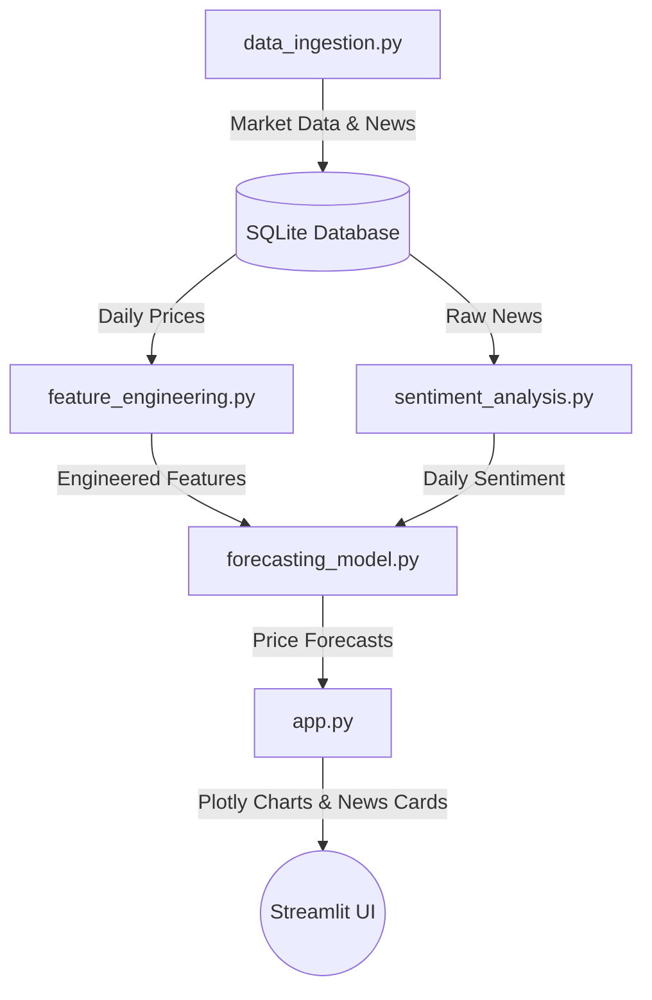

# Stock Analytics & Sentiment Intelligence Dashboard

An end-to-end stock market analytics, NLP-driven sentiment scoring, and time-series predictive forecasting pipeline. This application comes in two modes: a database-driven local pipeline with machine learning forecasts, and an in-memory, RAM-optimized real-time application ready for cloud deployment.

---

## 🏗️ System Architecture

The project consists of a multi-stage database pipeline and an independent cloud-ready interface. The core pipeline flow is organized as follows:



---

## 📁 Repository Structure

```text
├── data/                    # Ignored local SQLite database storage
├── venv/                    # Ignored local virtual environment
├── .env                     # Local secrets configuration (ignored)
├── .gitignore               # Excludes database, env secrets, and build files
├── models.py                # Database declarative mappings (SQLAlchemy 2.0)
├── data_ingestion.py        # Ingestion script for market prices and news headlines
├── feature_engineering.py   # Vectorized technical indicator computations
├── sentiment_analysis.py    # NLP headline scoring using FinBERT & VADER
├── forecasting_model.py     # Time-series machine learning model using Prophet
├── app.py                   # Local interactive multi-tab dashboard
├── app_cloud.py             # Cloud-ready, in-memory real-time dashboard
└── requirements.txt         # Project package dependencies
```

---

## ⚙️ Core Pipeline Modules

### 1. Database Schema (`models.py`)
Defines the relational tables using modern **SQLAlchemy 2.0** declarative syntax:
*   **`StockPrice`**: Historical daily Open, High, Low, Close, and Volume (OHLCV) values.
*   **`StockNews`**: Headlines metadata including publication timestamps, source names, and article links.
*   **`DailySentiment`**: Aggregated daily sentiment scores mapping to specific tickers.
*   **`PriceForecast`**: 30-day future forecasting values alongside lower and upper boundaries.

### 2. Ingestion Pipeline (`data_ingestion.py`)
Queries public APIs and populates raw databases:
*   Uses `yfinance` to fetch **1 year** of daily price records for AAPL, GOOGL, TSLA, MSFT, and NVDA.
*   Uses `newsapi-python` to fetch recent article titles over the last **30 days**.
*   Implements transactional batch commits per ticker for efficiency.

### 3. Quantitative Feature Engineering (`feature_engineering.py`)
Performs feature computations inside the SQLite engine:
*   Generates a **continuous daily calendar index** and applies forward-filling (`ffill()`) to bridge gaps caused by exchange holidays and weekends.
*   Calculates vectorized technical features:
    *   **Returns**: Percent change of close price.
    *   **Volatility**: 30-day rolling standard deviation of daily returns.
    *   **Wilder's RSI**: 14-day Relative Strength Index using exponential moving averages.
    *   **MACD**: 12 and 26-period EMAs with a 9-period signal line and histogram.
    *   **Bollinger Bands**: 20-period moving average shifted +/- 2 standard deviations.
*   Automatically drops duplicate dates on ingestion to prevent reindexing failures.

### 4. NLP Sentiment Analyzer (`sentiment_analysis.py`)
Runs neural and lexicon sentiment evaluation on headlines:
*   **FinBERT (`ProsusAI/finbert`)**: Evaluates financial nuance from HuggingFace pipelines. Headlines are scored dynamically as `positive - negative`.
*   **VADER (`SentimentIntensityAnalyzer`)**: Standard rule-based lexicon parsing to generate baseline `compound` scores.
*   **Composite Index**: Merges both models (`70% FinBERT + 30% VADER`) into a stable, highly predictive scoring system.
*   Aggregates average scores daily and runs an **upsert** (insert-on-conflict-update) database operation.

### 5. Time-Series Prophet Forecasts (`forecasting_model.py`)
Maintains predictive capabilities:
*   Inner-joins features and sentiment tables on `(ticker, date)`.
*   Trains a **Facebook Prophet** model per ticker using the composite daily sentiment score as an **external regressor**.
*   Validates models out-of-sample (evaluating **RMSE** and **MAPE**) on the last 30 days of data.
*   Fits the final model on 100% of historical data, projects 30 days out into the future (using 7-day rolling sentiment average as a future placeholder), and writes predictions to `price_forecasts`.

### 6. Interactive User Interface (`app.py`)
Streamlit dashboard showcasing pipeline analytics:
*   **Market Technicals Tab**: Render multi-axis synchronized Plotly charts overlaying Candlesticks with Bollinger Bands, alongside lower subplots for RSI and MACD.
*   **Sentiment & Forecast Trends Tab**: Displays historical closing prices, 30-day Prophet forecasting lines, and shaded confidence bounds.
*   **Live News Feed Tab**: Lists raw article headlines with bullish, bearish, or neutral styling borders.

---

## ☁️ Cloud Application Deployment (`app_cloud.py`)

To deploy on ephemeral container platforms (like **Streamlit Cloud**) that enforce memory limits (>1GB free tiers) and disallow writing local database files, `app_cloud.py` is configured as a standalone application:
1.  **In-Memory Execution**: No database engines or local filesystem connections are configured.
2.  **RAM Optimization**: HuggingFace/FinBERT loading is completely disabled. VADER Sentiment analysis is run exclusively on-the-fly.
3.  **Real-Time Data Ingestion**: Uses a single cached function (`@st.cache_data(ttl=300)`) to fetch 5 days of 5-minute intraday bars and news headlines, computing all technical indicators in memory.
4.  **Secrets Management**: Key retrieval relies on Streamlit's cloud-secrets manager (`st.secrets["NEWS_API_KEY"]`) rather than local files.
5.  **Offline Fallbacks**: Gracefully serves mock headline sentiment analyses when NewsAPI keys are rate-limited or blocked on serverless hostings.

---

## 🚀 Setup & Execution Instructions

### 1. Prerequisites
Ensure you have Python 3.10+ installed on your system.

### 2. Install Dependencies
Create a virtual environment, activate it, and install required libraries:
```bash
# Windows
python -m venv venv
venv\Scripts\activate
pip install -r requirements.txt

# macOS / Linux
python3 -m venv venv
source venv/bin/activate
pip install -r requirements.txt
```

### 3. Configure Local Secrets
Create a `.env` file in the root workspace directory:
```env
NEWS_API_KEY=your_newsapi_org_api_key
DATABASE_URL=sqlite:///data/stock_data.db
```

### 4. Run the Data Pipeline
Execute the data processing scripts sequentially to populate the database:
```bash
# Ingest raw prices and news headlines
venv\Scripts\python.exe data_ingestion.py

# Compute technical indicators
venv\Scripts\python.exe feature_engineering.py

# Run sentiment scoring models
venv\Scripts\python.exe sentiment_analysis.py

# Generate Prophet forecasts
venv\Scripts\python.exe forecasting_model.py
```

### 5. Launch the Dashboards
Start your choice of Streamlit dashboards:
```bash
# Run local database-driven application
streamlit run app.py

# Run real-time cloud-optimized application
streamlit run app_cloud.py
```

---

## 🔐 Streamlit Cloud Secrets Setup
To deploy the real-time app to Streamlit Cloud, add the following key inside your project's Streamlit Dashboard Settings (**Advanced Settings -> Secrets**):

```toml
NEWS_API_KEY = "your_actual_newsapi_key_string"
```

---

## 📄 License
This project is open-source and available under the **MIT License**.
