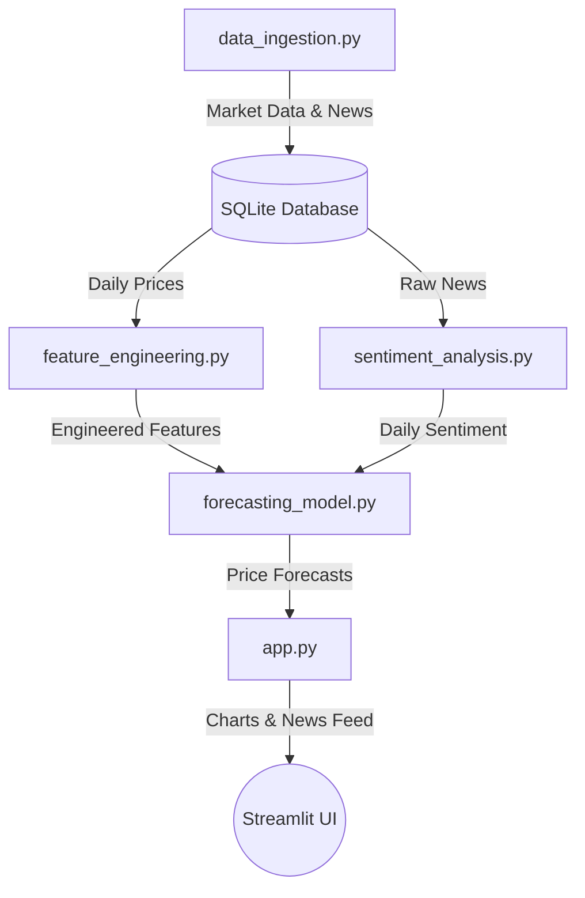

# Stock Sentiment Analytics Dashboard

This repository contains an end-to-end data pipeline and dashboard application that integrates historical stock prices, news headlines, and predictive machine learning models to analyze market sentiment. 

The project includes two main paths of execution: a local database-driven pipeline that runs quantitative forecasting models, and a lightweight, in-memory version designed for direct deployment to serverless hosting platforms like Streamlit Cloud.

---

## Architecture Overview

The core local pipeline handles data collection, database storage, feature computation, and time-series model training:



For serverless environments, the cloud version bypasses local storage and model execution to process all indicators and VADER sentiment scores in-memory on real-time data feeds.

---

## Project Structure

*   **models.py**: Database schema declarations using SQLAlchemy 2.0 mapping.
*   **data_ingestion.py**: Script to query historical market prices and news headlines.
*   **feature_engineering.py**: Calculations for stock indicators (RSI, Bollinger Bands, MACD, etc.).
*   **sentiment_analysis.py**: NLP sentiment scoring utilizing FinBERT and VADER models.
*   **forecasting_model.py**: Time-series forecasting model using Facebook Prophet.
*   **app.py**: Interactive multi-tab dashboard built for local database connections.
*   **app_cloud.py**: Self-contained Streamlit application optimized for cloud containers.
*   **requirements.txt**: Package dependencies required to run the pipeline.
*   **.gitignore**: Prevents local environments, database files, and secrets from being committed.

---

## Technical Specifications

### Database Schema (models.py)
Uses SQLAlchemy declarative mappings to structure four SQLite tables:
*   **StockPrice**: Stores daily historical open, high, low, close, and volume details.
*   **StockNews**: Stores article metadata (title, publisher timestamp, source, URL).
*   **DailySentiment**: Stores daily average sentiment scores calculated per ticker.
*   **PriceForecast**: Stores future predictions along with upper and lower confidence intervals.

### Data Ingestion (data_ingestion.py)
*   Fetches **1 year** of daily price history per ticker from Yahoo Finance using yfinance.
*   Fetches recent article titles from the last **30 days** using the NewsAPI client.
*   Commits database records in batches per ticker to limit write locks.

### Feature Calculations (feature_engineering.py)
*   Reindexes price history to a continuous daily frequency (using forward filling) to bridge weekend and holiday exchange closures.
*   Calculates vectorized indicators:
    *   **Returns**: Percent change of close price.
    *   **Volatility**: 30-day rolling standard deviation of daily returns.
    *   **RSI**: 14-period Relative Strength Index with exponential moving averages.
    *   **MACD**: 12 and 26-period EMAs with a 9-period signal line and histogram.
    *   **Bollinger Bands**: 20-period moving average shifted +/- 2 standard deviations.

### Sentiment Analysis (sentiment_analysis.py)
*   **FinBERT**: Financial language model that evaluates context-specific sentiment, outputting positive minus negative scores.
*   **VADER**: Rule-based sentiment intensity analyzer.
*   **Composite Index**: Combines both scores (70% FinBERT and 30% VADER) to calculate a balanced sentiment metric.
*   Saves daily aggregates using SQLite insert-or-update queries.

### Machine Learning Forecasts (forecasting_model.py)
*   Inner-joins engineered features and daily sentiment scores.
*   Trains Facebook Prophet models using the sentiment score as an external regressor.
*   Validates out-of-sample performance (RMSE and MAPE) on the last 30 entries of historical data.
*   Fits the final model on all historical data and writes a 30-day future forecast to the database.

---

## Cloud Deployment (app_cloud.py)

For platforms like Streamlit Cloud where resources are limited (free tiers enforce a 1GB RAM cap) and databases cannot be written locally:
*   **In-Memory Processing**: Operates without SQLite dependencies.
*   **Memory Optimization**: Disables PyTorch/FinBERT architectures. Sentiment scores are calculated on-the-fly using VADER.
*   **Intraday Feed**: Fetches 5 days of 5-minute bars using yfinance and calculates technical indicators in-memory.
*   **Secrets Configuration**: Reads the NewsAPI Key from Streamlit Secrets (`st.secrets["NEWS_API_KEY"]`) instead of a local file.
*   **Robust Fallback**: Includes realistic simulated news datasets to prevent crashes if the API key is missing or rate-limited.

---

## Setup & Local Run Instructions

### 1. Environment Setup
Activate a virtual environment and install the required dependencies:

```bash
# Windows
python -m venv venv
venv\Scripts\activate
pip install -r requirements.txt

# macOS / Linux
python3 -m venv venv
source venv/bin/activate
pip install -r requirements.txt
```

### 2. Configure Secrets
Create a `.env` file in the root directory:

```env
NEWS_API_KEY=your_api_key_here
DATABASE_URL=sqlite:///data/stock_data.db
```

### 3. Run Pipeline Scripts
Execute the scripts in order to build and populate the local database:

```bash
python data_ingestion.py
python feature_engineering.py
python sentiment_analysis.py
python forecasting_model.py
```

### 4. Start the Application
Run your preferred version of the dashboard:

```bash
# Run local database dashboard
streamlit run app.py

# Run real-time cloud dashboard
streamlit run app_cloud.py
```

---

## Streamlit Cloud Secrets Configuration
If deploying `app_cloud.py` to Streamlit Community Cloud, add your API key in the Advanced Settings (Secrets panel) using the following format:

```toml
NEWS_API_KEY = "your_actual_newsapi_key_here"
```

---

## License
This project is open-source and released under the MIT License.
